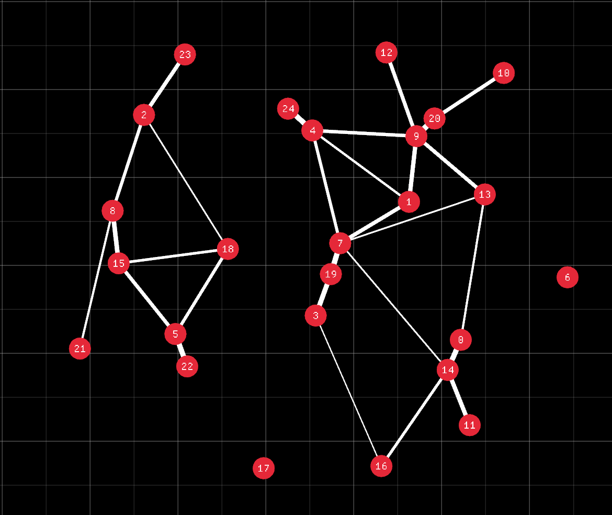

# Graph Display
A program allowing for ordered displaying of complex graphs.

It works by simulating node connections as springs.

https://github.com/gre-v-el/Graph-Display/assets/95856287/f34f73ee-5f8c-4731-aea0-08d93aa6cf41

